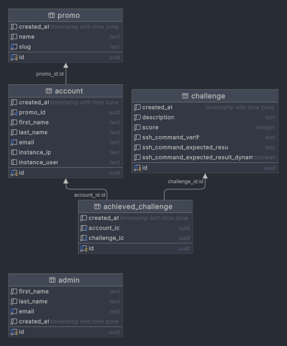

# MT4 Production Project
## Défiez-vous avec notre application web amusante et engageante!
Notre application web est simple à utiliser et permet aux étudiants de relever des défis de manière amusante et engageante. En tant qu'administrateur, vous pouvez facilement ajouter des défis et fournir un lien unique à chaque étudiant de la promo. Les étudiants peuvent ensuite cliquer sur le lien, créer un compte et lancer le défi.

Notre application prend en charge les étudiants qui ont déjà un compte et les nouveaux utilisateurs qui doivent valider leur compte. Les étudiants peuvent renseigner les informations nécessaires et lancer le défi. Notre application est conçue pour se connecter à l'instance de test, effectuer des tâches et des validations, et retourner des erreurs si nécessaire. Les erreurs exposent clairement ce qui est demandé ou fournissent des messages d'erreur transférés de l'instance de test pour que les étudiants puissent facilement lire et corriger le problème.

Le score est remis à zéro à chaque fois qu'un défi est relancé, mais il peut y avoir des exceptions où le score est conservé pour une tâche particulière en permanence. Vous pouvez facilement récupérer les scores de la promo en tableau visuel ou les télécharger pour une analyse plus approfondie.

Notre application est facile à utiliser et permet aux étudiants de relever des défis de manière amusante et engageante. Essayez-le dès maintenant et découvrez comment notre application peut aider vos étudiants à se préparer pour leur future carrière.

Adoptez notre projet pour offrir à vos étudiants une expérience d'apprentissage unique et innovante!
## Project links

- Doc App -> https://mt4challenge.onrender.com/swagger/app
- Doc Back-office -> https://mt4challenge.onrender.com/swagger/app
- Prod App -> https://mt4challenge.netlify.app/
- Prod Back-office -> https://mt4challenge-back-office.netlify.app/


## Questions/answers

- 1er défi -> créer un fichier helloworld.txt et mettre dedans Hello, World!
- 2eme défi -> créer un fichier byebyeworld.txt et mettre dedans Bye, Bye, World!
- 3eme défi -> télécharger un fichier et mettre le contenu dans un dossier appelé "bastien"
- 4e et dernier -> créer un script today_french.sh qui doit retourner la 18 avril 2024
Texte du projet : 

1 -> Bienvenue au premier défi !<br/>Pour ce premier défi, nous allons commencer par une 
tâche fondamentale: créer un fichier <code>helloworld.txt</code>, le fichier doit contenir le texte "Hello, World!". Cela peut sembler simple, mais c'est en fait un élément clé de la programmation, car c'est souvent le premier programme qu'un développeur écrit en apprenant un nouveau langage de programmation'

2 -> Vous devez créer un fichier <code>byebyeworld.txt</code>, le fichier doit contenir le texte "Bye Bye, World!".

3 -> Pour ce challenge, il est nécessaire de télécharger ces fichier (https://we.tl/t-jYOz9v07GF).<br/>Nous avons besoin de compter le nombres de fichier contenant l'extension <code>js</code>, <code>json</code> ou <code>py</code>. Attention! Nous voulons ignorer les fichiers dont la taille est inférieure à 500 kilobytes (kB). Veuillez créer un script <code>count_files.sh</code>

4 -> Créer le script <code>today_french.sh</code> qui retourne la date en français dans le format suivant <code>18 avril 2024</code>


## Answers
## Réponse 1 : 
```shell
1. Ouvre l'interpréteur de commande.
2. Tape "touch helloworld.txt" pour créer un fichier vide nommé helloworld.txt.
3. Tape "echo 'Hello, World!' > helloworld.txt" pour écrire "Hello, World!" dans le fichier.
```
## Réponse 2 : 
```shell
1. Ouvre l'interpréteur de commande.
2. Tape "touch byebyeworld.txt" pour créer un fichier vide nommé byebyeworld.txt.
3. Tape "echo 'Bye, Bye, World!' > byebyeworld.txt" pour écrire "Bye, Bye, World!" dans le fichier.
```
## Réponse 3 : 
```shell
#!/bin/bash

# Variable pour stocker le nombre de fichiers
count=0

# Fonction récursive pour parcourir les fichiers
parcourir_repertoire() {
    local dir="$1"
    for file in "$dir"/*; do
        if [ -f "$file" ]; then
            # Vérifier si le fichier est un fichier texte avec une taille supérieure à 500 ko
            if [[ "$file" == *.json || "$file" == *.js ]] && [ $(du -k "$file" | cut -f1) -gt 500 ]; then
                ((count++))  # Incrémenter le compteur de fichiers
            fi
        elif [ -d "$file" ]; then
            # Appel récursif si le fichier est un répertoire
            parcourir_repertoire "$file"
        fi
    done
}

# Chemin du répertoire "bastien" dans le bureau
directory="./bastien"

# Vérifier si le répertoire existe
if [ ! -d "$directory" ]; then
    echo "Répertoire introuvable."
    exit 1
fi

# Appeler la fonction de parcours du répertoire pour chaque sous-répertoire
parcourir_repertoire "$directory"

# Afficher le nombre de fichiers correspondant aux critères
echo "$count"
}
```

## Réponse 4 : 
```shell
1. Ouvre l'interpréteur de commande.
2. Tape "nano today_french.sh" pour ouvrir l'éditeur de texte nano.
3. Tape les commandes suivantes dans le fichier :

#!/bin/bash
date +"%d %B %Y" | sed 's/January/janvier/;s/February/février/;s/March/mars/;s/April/avril/;s/May/mai/;s/June/juin/;s/July/juillet/;s/August/août/;s/September/septembre/;s/October/octobre/;s/November/novembre/;s/December/décembre/'

4. Sauvegarde le fichier en tapant "Ctrl + O" puis "Enter", puis quitte l'éditeur de texte en tapant "Ctrl + X".
5. Tape "chmod +x today_french.sh" pour rendre le script exécutable.
6. Tape "./today_french.sh" pour exécuter le script et afficher la date en français dans le format demandé.
```
## Database schema and implementation



## Color Reference

| Color             | Hex                                                                |
| ----------------- | ------------------------------------------------------------------ |
| Header Background |  #1B1B38 |
| Font Background |  #D4D4D4 |
| Form Background|  #32325A |

## Logo Challenge

<p align="left">
  
</p>

## Authors
Eliel Hazan, Amanda Elfassy, Djibril Bathily, Illes Taouage, Dorian Vidal

<p align="center">
    
</p>

## Run Locally

Voici les étapes pour installer un projet depuis GitHub avec toutes les dépendances nécessaires pour un projet en Vue.js, NodeJS, Typescript :

1. Clonez le projet en utilisant la commande suivante dans votre terminal : 

```bash
git clone https://link-to-project
```

2. Accédez au répertoire du projet en utilisant la commande suivante :

```bash
cd my-project
```

3. Installez Node.js sur votre ordinateur en téléchargeant l'installateur sur le site officiel de Node.js.

4. Installez npm (Node Package Manager) en utilisant la commande suivante dans votre terminal :

```bash
npm install npm@latest -g
```

5. Installez toutes les dépendances du projet en utilisant la commande suivante :

```bash
npm install
```

6. Démarrez le serveur en utilisant la commande suivante :

```bash
npm run start
```

7. Ouvrez votre navigateur et accédez à l'URL suivante : `http://localhost:3000` pour voir le projet en cours d'exécution.

Ces étapes devraient vous permettre d'installer et d'exécuter un projet à partir de GitHub avec toutes les dépendances nécessaires pour un projet en Vue.js, NodeJS, Typescript.

